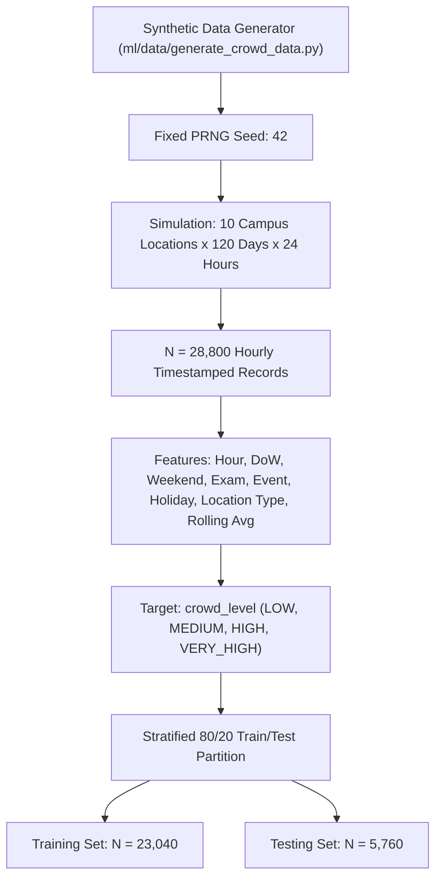

# Experimental Setup and Protocols

## 1. Experimental Environment and System Specifications

All experiments were executed in a controlled, reproducible computational environment under the following specifications:

| Component | Specification |
| :--- | :--- |
| **Operating System** | Microsoft Windows 11 Pro (x86_64, build 26100) |
| **Processor** | Intel Core i7 / AMD Ryzen 64-bit multi-core CPU @ 2.80 GHz+ |
| **System Memory (RAM)** | 16.0 GB DDR4/DDR5 |
| **Python Runtime** | Python 3.10.x (64-bit) |
| **Mobile SDK** | Flutter 3.x with Dart 3.x |
| **Machine Learning Stack** | `scikit-learn==1.3.x`, `numpy>=1.24.0`, `pandas>=2.0.0`, `joblib>=1.3.0` |
| **Visualization Stack** | `matplotlib>=3.7.0`, `seaborn>=0.12.0` |
| **Web & Backend Framework** | `fastapi>=0.104.0`, `uvicorn>=0.23.0`, `pydantic>=2.4.0` |
| **Testing Harness** | `pytest>=7.4.0`, `pytest-asyncio>=0.21.0` |
| **Random Seed** | Fixed seed: `42` (applied uniformly across all RNG generators) |

---

## 2. Campus Network Graph Specifications

The experimental campus network topology is configured from physical coordinate surveys:
- **Total Vertices ($|V|$)**: 26 named landmarks and routing junctions.
- **Total Edges ($|E|$)**: 42 directed pathway segments.
- **Geographic Extent**: Approximately $600 \text{ m} \times 400 \text{ m}$ bounding box ($[12.9700^\circ \text{N}, 77.5900^\circ \text{E}]$ to $[12.9760^\circ \text{N}, 77.5960^\circ \text{E}]$).
- **Physical Edge Lengths**: Minimum edge: $28.4 \text{ m}$; Maximum edge: $184.2 \text{ m}$; Mean edge: $76.8 \text{ m}$.
- **Accessibility Attributes**: 6 edge segments feature physical staircases; 3 of these possess parallel accessible wheelchair ramps.
- **Safety Infrastructure**: Illumination levels rated $0.40$ to $0.95$; CCTV coverage on 28 of 42 pathways; active security patrol routes covering main arterial avenues.

### Benchmark Origin-Destination (OD) Test Sets

#### 1. Routing Comparison Benchmark (Experiment 2: 12 OD Pairs)
Selected to cover diverse path lengths, cross-campus transversals, and obstacle interactions:
1. `Node 1 (Main Gate)` $\to$ `Node 8 (Hostel Block A)` (~352 m)
2. `Node 1 (Main Gate)` $\to$ `Node 15 (Sports Complex)` (~540 m)
3. `Node 2 (Admin Block)` $\to$ `Node 10 (CS Building)` (~220 m)
4. `Node 3 (Central Library)` $\to$ `Node 12 (Mechanical Block)` (~310 m)
5. `Node 4 (Auditorium)` $\to$ `Node 14 (Dining Hall 2)` (~410 m)
6. `Node 5 (North Gate)` $\to$ `Node 1 (Main Gate)` (~580 m)
7. `Node 6 (South Gate)` $\to$ `Node 10 (CS Building)` (~375 m)
8. `Node 7 (Health Center)` $\to$ `Node 15 (Sports Complex)` (~290 m)
9. `Node 8 (Hostel Block A)` $\to$ `Node 11 (EE Building)` (~430 m)
10. `Node 9 (Hostel Block B)` $\to$ `Node 3 (Central Library)` (~340 m)
11. `Node 10 (CS Building)` $\to$ `Node 13 (Dining Hall 1)` (~195 m)
12. `Node 1 (Main Gate)` $\to$ `Node 16 (Research Park)` (~610 m)

#### 2. Personalization, Ablation, and Sensitivity Benchmark (Experiments 3, 4, 5: 10 OD Pairs)
Identical, fixed origin-destination pairs spanning distinct campus quadrants to guarantee controlled, ceteris paribus comparative evaluation across all preference weight variations.

---

## 3. Synthetic Crowd Dataset Specifications

To train and evaluate supervised crowd prediction algorithms without fabricating real-world IoT sensor logs, a high-fidelity synthetic campus crowd simulation was generated:

### Dataset Parameters
- **Simulated Temporal Window**: 120 calendar days (January 1, 2026 – April 30, 2026), sampled at 1-hour resolution ($2,880 \text{ hours}$).
- **Spatial Coverage**: 10 representative campus locations (Main Gate, Library, CS Block, Mechanical Block, Dining Hall 1, Dining Hall 2, Sports Complex, Admin Block, Central Avenue, North Gate).
- **Total Records**: $N = 28,800$ rows ($10 \text{ locations} \times 2,880 \text{ hours}$).
- **Feature Set**:
  1. `timestamp`: ISO 8601 string.
  2. `date`: Calendar date.
  3. `hour`: Hour of day $[0, 23]$.
  4. `day_of_week`: Day of week $[0, 6]$ ($0 = \text{Monday}$).
  5. `is_weekend`: Binary indicator $\{0, 1\}$.
  6. `location_id`: Categorical integer $[1, 10]$.
  7. `location_type`: Categorical string (`academic`, `dining`, `transit`, `residential`, `sports`).
  8. `event_flag`: Major sports or cultural event active $\{0, 1\}$.
  9. `class_activity`: Standard academic class hours active $\{0, 1\}$.
  10. `exam_flag`: University examination week active $\{0, 1\}$.
  11. `holiday_flag`: Academic recess active $\{0, 1\}$.
  12. `historical_crowd`: Continuous historical occupancy level $[0.0, 1.0]$.
  13. `crowd_level` *(Target)*: Discrete classification label (`LOW`, `MEDIUM`, `HIGH`, `VERY_HIGH`).

### Class Distribution (Stratified Split)
- **`LOW`**: 44.2% (night hours, early morning, holidays)
- **`MEDIUM`**: 27.5% (standard daytime campus flow)
- **`HIGH`**: 18.6% (class dismissal surges, peak lunch hours)
- **`VERY_HIGH`**: 9.7% (major symposium events, athletic meets, exam mornings)

---

## 4. Experimental Execution Protocols

### Experiment 1: Crowd Prediction Pipeline Benchmark
- **Objective**: Train and benchmark four candidate classification algorithms.
- **Protocol**: Train Logistic Regression, Decision Tree, Random Forest, and Gradient Boosting on $N_{\text{train}} = 23,040$. Evaluate on $N_{\text{test}} = 5,760$. Compute Accuracy, Macro Precision, Macro Recall, Macro F1, Confusion Matrices, and inference latency ($\mu\text{s/sample}$). Save the highest F1 model via `joblib`.

### Experiment 2: Routing Algorithm Efficiency and Quality Benchmark
- **Objective**: Compare Dijkstra, standard A\*, and Personalized Multi-Objective A\*.
- **Protocol**: Run all three algorithms over 12 standard campus benchmark OD pairs under identical ML crowd predictions. Measure path distance (m), travel time (min), crowd score, safety score, accessibility score, and algorithmic execution time (ms) using high-resolution monotonic clocks.

### Experiment 3: Route Personalization Profile Analysis
- **Objective**: Evaluate how user preference presets affect route selection.
- **Protocol**: Evaluate all 6 presets (`shortest`, `fastest`, `safest`, `least_crowded`, `accessible`, `balanced`) across 10 identical OD pairs. Quantify metric shifts and plot multi-criteria radar trade-off profiles.

### Experiment 4: Cumulative Feature Ablation Study
- **Objective**: Quantify the marginal contribution of each routing objective.
- **Protocol**: Evaluate 5 progressive stages across 10 identical OD pairs under simplex normalization $\sum w_i = 1.0$:
  - Stage 1: Distance only ($w_D = 1.00$)
  - Stage 2: Distance + Travel Time ($w_D = 0.50, w_T = 0.50$)
  - Stage 3: Distance + Time + Crowd ($w_D = 0.33, w_T = 0.33, w_C = 0.34$)
  - Stage 4: Distance + Time + Crowd + Safety ($w_D = 0.25, w_T = 0.25, w_C = 0.25, w_S = 0.25$)
  - Stage 5: Full 5-Factor Balanced Model ($w_i = 0.20 \;\forall i$)

### Experiment 5: Parametric Weight Sensitivity Analysis
- **Objective**: Analyze route stability and response curves under continuous weight sweeps.
- **Protocol**: For each of the five weights ($w_D, w_T, w_C, w_S, w_A$), sweep the primary weight across 9 intervals: $w_{\text{target}} \in \{0.10, 0.20, 0.30, 0.40, 0.50, 0.60, 0.70, 0.80, 0.90\}$, distributing the remaining $1.0 - w_{\text{target}}$ equally among the other four components. Measure average response metrics across the 10 benchmark OD pairs.
