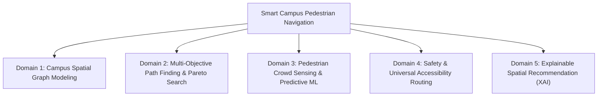

# Literature Review Structure and Search Protocol

> [!IMPORTANT]
> **Academic Integrity Notice**  
> In accordance with scholarly publication standards, this document establishes a **reproducible taxonomy, search protocol, and structural framework** for conducting a systematic literature review. It explicitly avoids inventing bibliographic citations or asserting preliminary candidate gaps as verified historical consensus. All search strings, database criteria, and comparative matrices are structured for empirical execution.

---

## 1. Thematic Taxonomy

To position SafeCampus AI rigorously within existing scientific discourse, the literature review is structured into five interconnected thematic domains:



### Domain 1: Campus Spatial Graph Modeling & Micro-Urban Networks
- **Core Topics**: Representation of multi-level pedestrian environments, indoor-outdoor transitions, topological GIS graph abstraction, edge attribution for non-vehicular pathways.
- **Focus Questions**:
  - How do existing smart campus systems represent campus topologies (discrete node-edge graphs vs. continuous raster surfaces)?
  - How are micro-spatial walking constraints (stairs, ramps, elevation, curb cuts) modeled in pedestrian road networks?

### Domain 2: Multi-Objective Shortest Path Algorithms & Pareto Optimization
- **Core Topics**: Bi-criteria and multi-criteria shortest path problems (MCSPP), Pareto-optimal path computation, scalarization techniques (weighted sum method), multi-objective A\* variants (NAMOA\*, BOA\*), heuristic admissibility under multi-attribute cost structures.
- **Focus Questions**:
  - What are the computational complexity limits of exact Pareto search vs. scalarized A\* search in real-time pedestrian routing?
  - How can heuristic functions remain admissible when combining heterogeneous dimensional metrics (meters, minutes, dimensionless risk scores)?

### Domain 3: Pedestrian Crowd Sensing & Predictive Modeling in Campus Facilities
- **Core Topics**: Indoor/outdoor crowd density estimation, IoT sensor streams (Wi-Fi probe counts, BLE beacons, CCTV video analytics), supervised time-series and tabular forecasting, academic calendar-aware demand modeling.
- **Focus Questions**:
  - What feature representations (e.g., cyclical hour encodings, class schedules, exam periods) best predict pedestrian surges?
  - How do shallow tree ensembles (Random Forest, Gradient Boosting) compare with linear baselines and deep sequential models in terms of inference latency and tabular data efficiency?

### Domain 4: Safety and Universal Accessibility in Pedestrian Routing
- **Core Topics**: Crime Prevention Through Environmental Design (CPTED), illuminated nocturnal navigation, perception of safety vs. empirical crime statistics, Americans with Disabilities Act (ADA) compliance, barrier-free route planning for wheelchair and reduced-mobility users.
- **Focus Questions**:
  - How are environmental safety attributes (streetlighting intensity, CCTV presence, sightlines) quantified into numerical edge costs?
  - How do existing navigation engines enforce hard obstacle avoidance (e.g., zero stairs) vs. soft cost penalties?

### Domain 5: Explainable AI (XAI) in Spatial Recommendation Systems
- **Core Topics**: Interpretability in multi-criteria decision making (MCDM), contrastive and counterfactual explanations, natural language generation for spatial trade-offs, user trust and compliance in algorithmic guidance.
- **Focus Questions**:
  - How can trade-offs across competing routing objectives (e.g., extra walking distance incurred to gain improved illumination or lower crowd density) be transparently communicated to end-users?
  - What explanation modalities (textual summaries, metric deltas, radar charts) optimize user comprehension and perceived safety?

---

## 2. Systematic Search Protocol

### Targeted Bibliographic Databases
1. **IEEE Xplore Digital Library** (IEEE Transactions on Intelligent Transportation Systems, IEEE Access, IEEE Pervasive Computing)
2. **ACM Digital Library** (ACM Transactions on Spatial Algorithms and Systems, ACM SIGSPATIAL)
3. **ScienceDirect / Elsevier** (Transportation Research Part C: Emerging Technologies, Expert Systems with Applications, Pervasive and Mobile Computing)
4. **SpringerLink** (Journal of Ambient Intelligence and Humanized Computing, Applied Intelligence)
5. **Google Scholar** (For cross-indexing and recent preprints/conference proceedings)

### Search Query Formulations

#### Query 1: Multi-Objective Campus Pedestrian Routing
```text
("smart campus" OR "university campus") AND 
("pedestrian routing" OR "path finding" OR "wayfinding") AND 
("multi-objective" OR "multi-criteria" OR "Pareto")
```

#### Query 2: Dynamic Crowd Prediction in Navigation
```text
("crowd prediction" OR "crowd density" OR "occupancy forecasting") AND 
("route recommendation" OR "path planning" OR "navigation system") AND 
("machine learning" OR "random forest" OR "gradient boosting")
```

#### Query 3: Safety and Accessibility in Smart Walking Systems
```text
("pedestrian safety" OR "safe route" OR "illuminated path") AND 
("accessibility" OR "wheelchair" OR "barrier-free") AND 
("routing algorithm" OR "A-star" OR "Dijkstra")
```

#### Query 4: Explainable Navigation
```text
("explainable AI" OR "XAI" OR "explanation") AND 
("route recommendation" OR "spatial decision" OR "path recommendation")
```

### Inclusion and Exclusion Criteria

| Criterion | Inclusion Requirements | Exclusion Rules |
| :--- | :--- | :--- |
| **Publication Year** | Peer-reviewed works published between 2018–2026 | Pre-2018 publications (unless foundational algorithmic literature) |
| **Domain** | Pedestrian, campus, micro-urban, indoor-outdoor mobility | Exclusively vehicular, highway, or aerial/maritime routing |
| **Methodology** | Algorithmic path-finding, multi-objective optimization, ML prediction | Purely theoretical graph theory without implementation or empirical data |
| **Language** | English full-text articles | Non-English publications or abstracts only |

---

## 3. Comparative Literature Review Matrix Template

When conducting the systematic review, surveyed papers must be indexed using the following standardized comparative matrix:

| Citation ID | Author(s) & Year | Problem Domain | Routing Method (e.g., A\*, Pareto, GA) | Dynamic Crowd Integrated? (Yes/No/Method) | Safety Factor Modeled? (Yes/No/Metrics) | Accessibility Modeled? (Yes/No/Method) | Explainability Component? (Yes/No/Type) | Validation Method (Simulation / Field Study / Benchmark) |
| :--- | :--- | :--- | :--- | :--- | :--- | :--- | :--- | :--- |
| *[Ref-01]* | *(Author, Year)* | Campus Pedestrian | Multi-Objective A\* | Static estimate | Lighting score | Ramps vs. Stairs | None | Campus simulation |
| *[Ref-02]* | *(Author, Year)* | Urban Mobility | Dijkstra variant | Real-time sensor | None | Wheelchair grade | Textual summary | User study ($N=30$) |
| *[Ref-03]* | *(Author, Year)* | Smart Building | Deep Q-Learning | Wi-Fi probe ML | Fire exit safety | ADA compliance | Counterfactual | Synthetic grid |

---

## 4. Synthesis and Critical Analysis Blueprint

The synthesis section of the literature review must evaluate surveyed literature against four critical structural questions:

1. **How is the trade-off between physical distance and non-physical attributes resolved?**  
   Analyze whether prior works use hard filtering (e.g., pruning paths that exceed safety thresholds) versus continuous multi-attribute cost scalarization, and examine the convexity of their Pareto solutions.
2. **What is the operational latency of proposed solutions?**  
   Critique the computational feasibility of complex multi-criteria algorithms in real-time mobile environments requiring sub-second response times.
3. **How is contextual dynamic data captured and ingested?**  
   Differentiate between works relying on expensive, proprietary hardware vs. zero-cost, open-source software architectures.
4. **Is transparency and user control preserved?**  
   Identify whether existing applications permit users to configure their own weight priorities or enforce black-box recommendations.
