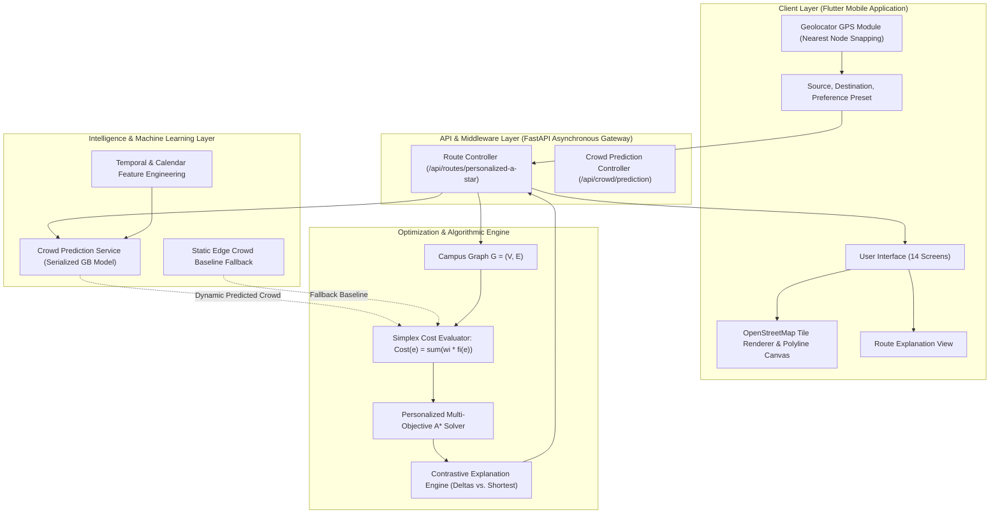

# Proposed Methodology and System Architecture

## 1. System Overview and End-to-End Workflow

SafeCampus AI is architected as an end-to-end intelligent navigation pipeline designed to deliver personalized, safety-aware, crowd-conscious, and accessible walking routes across university campus networks. The system bridges machine learning predictive analytics with graph-theoretic heuristic search and mobile geospatial visualization.

The runtime flow proceeds through seven sequential stages:
1. **Request Inception**: The user selects an Origin ($s$) and Destination ($d$) via campus node dropdowns, interactive map taps, or automatic GPS snapping to the nearest graph node, selecting a personal preference preset (`shortest`, `fastest`, `safest`, `least_crowded`, `accessible`, `balanced`).
2. **Feature Extraction**: The API service captures temporal context (hour of day, day of week, active academic events, examination schedules).
3. **Dynamic ML Crowd Inference**: The system issues batch crowd predictions for relevant campus nodes using the serialized Gradient Boosting model, mapping predictions to normalized continuous crowd costs $C(e) \in [0, 1]$.
4. **Edge Cost Computation**: Traversal costs for each candidate edge are evaluated dynamically using normalized distance, walking time, crowd cost, nocturnal safety penalty, and accessibility impedance.
5. **Heuristic Search Execution**: Personalized Multi-Objective A\* explores the graph, pruned by an admissible Haversine-based heuristic, identifying the optimal path $P^*$.
6. **Explanation Synthesis**: The Explanation Engine benchmarks $P^*$ against the physical shortest path $P_{\text{shortest}}$, computing exact mathematical trade-off percentages.
7. **Client Rendering**: The mobile client plots the recommended polyline atop OpenStreetMap tiles, renders navigation turn cards, and displays the contextual explanation.

---

## 2. Spatial Campus Graph Modeling

The campus physical walking network is modeled as an attributed directed multigraph $G = (V, E)$:
- **Vertices ($V$)**: $N = 26$ key campus locations, categorized into functional typologies:
  - *Academic Blocks*: CS Building, EE Building, Mechanical Engineering, Main Academic Block.
  - *Administrative & Support*: Administrative Block, Central Library, Health Center, Auditoriums.
  - *Residential & Dining*: Boys Hostels, Girls Hostels, Dining Halls, Food Courts.
  - *Perimeter & Transit*: Main Gate, North Gate, South Gate, Bus Stop, Sports Complex.
  - *Intersections*: Major pedestrian junctions and pathway crossways.
- **Edges ($E$)**: $|E| = 42$ pedestrian pathway segments, each annotated with physical infrastructure measurements:
  - Geographic length $D(e)$ calculated via high-precision spherical Haversine formulas.
  - Estimated walking transit time $T(e) = D(e) / v_{\text{walk}}$, where standard walking speed $v_{\text{walk}} = 1.33 \text{ m/s}$ ($80 \text{ m/min}$).
  - Safety attributes: Nocturnal illumination score, CCTV surveillance presence, and security patrol rating combined into a continuous safety index $S(e) \in [0, 1]$.
  - Accessibility attributes: Pavement surface quality, presence of stairs (`has_stairs`), and wheelchair ramp availability (`has_ramp`).

---

## 3. Machine Learning Crowd Prediction Pipeline

To provide anticipatory crowd avoidance, the system incorporates a dedicated supervised learning pipeline:

### Feature Engineering
The model transforms calendar and schedule signals into a structured tabular representation:
1. `hour`: Continuous hour $[0, 23]$ with cyclical sine and cosine harmonic transformations:
   $$\text{hour\_sin} = \sin\left(\frac{2\pi \cdot \text{hour}}{24}\right), \quad \text{hour\_cos} = \cos\left(\frac{2\pi \cdot \text{hour}}{24}\right)$$
2. `day_of_week`: Day index $[0, 6]$ with cyclical weekly encoding:
   $$\text{day\_sin} = \sin\left(\frac{2\pi \cdot \text{dow}}{7}\right), \quad \text{day\_cos} = \cos\left(\frac{2\pi \cdot \text{dow}}{7}\right)$$
3. `is_weekend`: Binary flag indicating Saturday/Sunday schedule shifts.
4. `is_exam_period`: Binary indicator of high-occupancy examination weeks.
5. `is_event_active`: Binary indicator of major sports meets, symposiums, or cultural events.
6. `is_holiday`: Binary indicator of university recess periods.
7. `location_type`: One-hot encoded categorical vector (Academic, Residential, Dining, Transit, Sports).
8. `historical_crowd_rolling_avg`: Moving average of historical density at the specified location.

### Model Selection and Training Protocol
Four candidate classification architectures were evaluated under identical 80/20 stratified train/test partitions ($N_{\text{total}} = 28,800$, $N_{\text{train}} = 23,040$, $N_{\text{test}} = 5,760$):
- **Logistic Regression**: Linear multi-class baseline with L2 regularization.
- **Decision Tree**: Non-parametric tree partitioner with Gini impurity splitting.
- **Random Forest**: Ensemble of 100 decorrelated decision trees with bootstrap aggregation.
- **Gradient Boosting**: Sequential gradient-boosted decision trees optimizing multi-class log-loss.

Based on empirical validation (Macro F1: 0.8366, Accuracy: 93.28%), Gradient Boosting was selected and serialized for real-time production inference.

---

## 4. Personalized Multi-Objective A\* Optimization Engine

The core optimization problem identifies the path $P^*$ minimizing a scalarized multi-attribute cost function:

$$Cost(e) = w_D \bar{D}(e) + w_T \bar{T}(e) + w_C \bar{C}(e) + w_S \bar{S}_{\text{cost}}(e) + w_A \bar{A}_{\text{cost}}(e)$$

subject to:
$$\sum_{i \in \{D, T, C, S, A\}} w_i = 1.0, \quad w_i \ge 0$$

### Dynamic Edge Cost Mapping
- **Normalized Distance**: $\bar{D}(e) = \frac{D(e)}{D_{\max}}$, where $D_{\max}$ is the maximum edge length across the graph.
- **Normalized Time**: $\bar{T}(e) = \frac{T(e)}{T_{\max}}$, where $T_{\max} = \frac{D_{\max}}{v_{\text{walk}}}$.
- **Dynamic Crowd Cost**: $\bar{C}(e) = \frac{1}{2}\left(C(u) + C(v)\right)$ for edge $e = (u, v)$, where $C(u), C(v) \in [0, 1]$ are obtained from the ML prediction service.
- **Safety Cost**: $\bar{S}_{\text{cost}}(e) = 1.0 - S(e)$.
- **Accessibility Cost**:
  $$\bar{A}_{\text{cost}}(e) = \begin{cases} 1.0 & \text{if } \text{has\_stairs}(e) \land \neg \text{has\_ramp}(e) \\ 1.0 - A(e) & \text{otherwise} \end{cases}$$

### Heuristic Admissibility
To guarantee exact optimality without sacrificing computational efficiency, the A\* search uses the normalized Haversine heuristic scaled by the distance weight $w_D$:
$$h(u, d) = w_D \cdot \frac{\text{Haversine}(u, d)}{D_{\max}}$$
Because all cost components are non-negative and $\text{Haversine}(u, d) \le \text{geodesic distance}(u, d)$, $h(u, d)$ never overestimates the remaining optimal multi-objective cost ($h(u, d) \le Cost^*(u, d)$), ensuring mathematical admissibility and monotonicity.

---

## 5. Contrastive Explanation Engine

Rather than displaying raw cost values, the Explanation Engine derives human-interpretable justifications by comparing the recommended route $P^*$ against the physical shortest route $P_{\text{shortest}}$:

$$\Delta D = \frac{D(P^*) - D(P_{\text{shortest}})}{D(P_{\text{shortest}})} \times 100\%$$
$$\Delta T = \frac{T(P^*) - T(P_{\text{shortest}})}{T(P_{\text{shortest}})} \times 100\%$$
$$\Delta C = \frac{\bar{C}(P^*) - \bar{C}(P_{\text{shortest}})}{\bar{C}(P_{\text{shortest}})} \times 100\%$$
$$\Delta S = \frac{\bar{S}(P^*) - \bar{S}(P_{\text{shortest}})}{\bar{S}(P_{\text{shortest}})} \times 100\%$$
$$\Delta A = \frac{\bar{A}(P^*) - \bar{A}(P_{\text{shortest}})}{\bar{A}(P_{\text{shortest}})} \times 100\%$$

These exact mathematical differentials are transformed into clear natural language explanations (e.g., *"Recommended because this path increases safety by +18.2% and reduces crowd exposure by -25.1%, with a minor distance addition of only 15.4 meters (+3.8%)"*).

---

## 6. Client Architecture and Mobile Mapping

The client is built using Flutter and Dart, adhering to a reactive architectural pattern:
- **State Management**: Implemented via `Provider` and `ChangeNotifier`, isolating business logic and API communication from UI widgets.
- **Mapping Canvas**: Implemented via `flutter_map`, consuming raster tiles from OpenStreetMap (OSM) tile servers without proprietary API tokens.
- **Polyline and Marker Rendering**: Draws color-coded route corridors, origin pins, destination flags, and intermediate junction nodes.
- **Resilient Fallback**: If network connectivity or tile servers are unavailable, the application gracefully maintains manual node selection, turning directions, and mathematical trade-off metrics.
